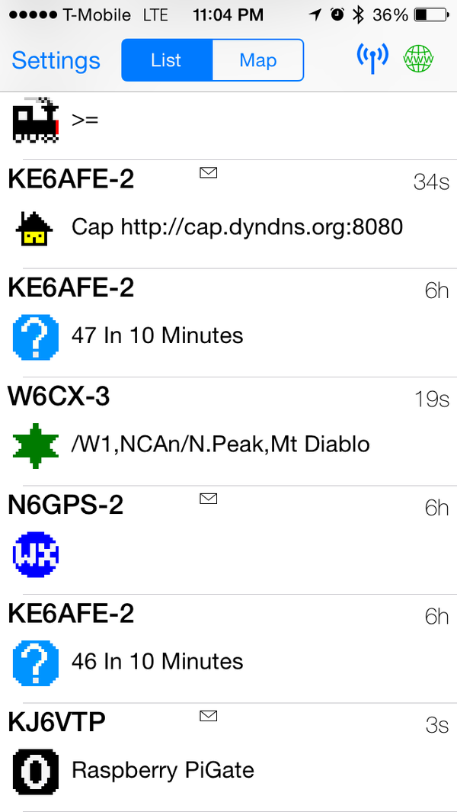
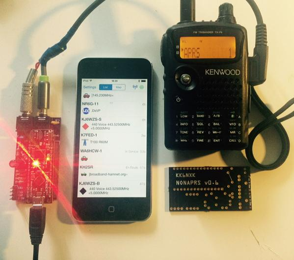

#NanoAPRS
A 1200 bauds modem based on an Arduino Nano mainly for APRS amateur radio.

The design is totally based on Mark Qvist [MicroModem](https://github.com/markqvist/MicroModem) but revamped for a Nano form factor, the main reason was to used a [Bluno Nano from DFRobot](http://www.dfrobot.com/index.php?route=product/product&product_id=1122&search=nano&description=true#.VWU739NViko), makes it suitable to be used with an iPhone!

nonaprs.fzz is the Fritzing file, the associated gerber files are in gerber_export directory.  
This is not the best PCB design but it works perfectly, I'm using it for an iPhone project I'm working on. 

You can order it on [OSHPark](https://oshpark.com/shared_projects/laC2cJYu).

You can program the modem with the [library from Mark](https://github.com/markqvist/LibAPRS)
